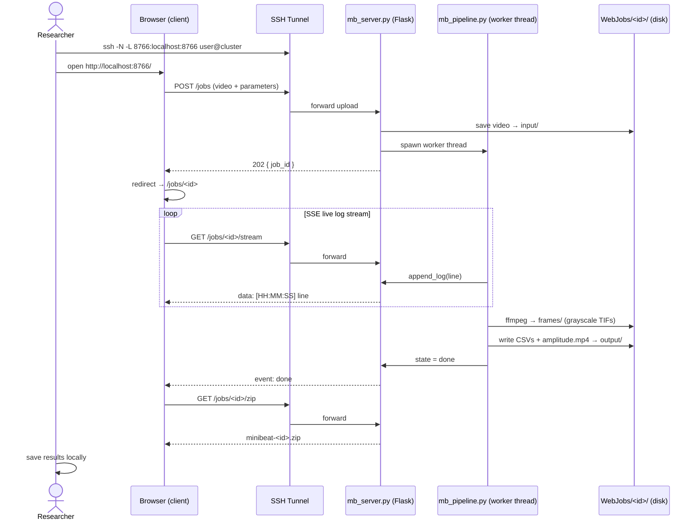

# [MiniBeat HPC Tracker](https://github.com/rabravo/minibeat-hpc-tracker)

The **server side** of [MiniBeat Tracker](https://github.com/rabravo/minibeat-tracker) —
a Flask web server that exposes the full cardiomyocyte motion analysis pipeline
to any browser over an SSH tunnel.

```
  [ Researcher's laptop ]              [ HPC cluster node ]
  ┌────────────────────┐               ┌─────────────────────────────┐
  │  Browser (client)  │◄─ SSH tunnel ─►│  mb_server.py  (Flask)      │
  │                    │               │  mb_pipeline.py (worker)    │
  │  • upload video    │               │  ffmpeg + minibeat-tracker  │
  │  • set parameters  │               │  numba · joblib · OpenCV    │
  │  • stream live log │               │                             │
  │  • download ZIP    │               │  binds to 127.0.0.1 only    │
  └────────────────────┘               └─────────────────────────────┘
```

No MATLAB, no GUI toolkit, no GPU required. The pipeline runs entirely on CPU
using the same numba-accelerated block matching and joblib parallelism as the
[MiniBeat Tracker](https://github.com/rabravo/minibeat-tracker) desktop app.

---

## Client–Server Model

| Role | Component | Runs on |
|------|-----------|---------|
| **Client** | Any web browser | Researcher's laptop |
| **Transport** | SSH port-forwarding | Encrypted tunnel |
| **Server** | `mb_server.py` (Flask) | HPC cluster node |
| **Worker** | `mb_pipeline.py` | Same cluster node (thread pool) |
| **Storage** | `WebJobs/<id>/` | Cluster filesystem |

The server binds to `127.0.0.1` only — there is **no authentication** on the
HTTP port. Security relies entirely on the SSH tunnel. Never expose the port
directly to a network.

---

## Request / Response Flow



---

## Pipeline Steps

| Step | Module | Action |
|------|--------|--------|
| 0 | ffmpeg | Extract grayscale TIF frames from video → `output/frames/` |
| 1 | `mb_pipeline.py` | Load extracted TIF frames |
| 2 | `minibeat_tracker.core.motion` | Exhaustive block matching (numba JIT + joblib) |
| 3 | `minibeat_tracker.core.analysis` | Contraction time series + peak detection |
| 4 | `minibeat_tracker.io.export` | CSV exports + amplitude overlay video |

---

## API Endpoints

| Method | Path | Description |
|--------|------|-------------|
| `GET` | `/` | Job list + submission form |
| `POST` | `/jobs` | Submit a new job (multipart: video + parameters) |
| `GET` | `/jobs/<id>` | Job detail page |
| `GET` | `/jobs/<id>/status` | JSON job snapshot |
| `GET` | `/jobs/<id>/stream` | SSE live log stream |
| `GET` | `/jobs/<id>/log?offset=N` | JSON log lines since offset |
| `GET` | `/jobs/<id>/files` | JSON list of output files |
| `GET` | `/jobs/<id>/download/<path>` | Download a single output file |
| `GET` | `/jobs/<id>/zip` | Download all output as ZIP |
| `DELETE` | `/jobs/<id>` | Delete a completed job |
| `GET` | `/health` | Server health check |

---

## Requirements

- Linux (HPC cluster or local workstation)
- Miniconda or Anaconda
- ffmpeg (frame extraction)

[MiniBeat Tracker](https://github.com/rabravo/minibeat-tracker) is bundled as a
git submodule — no separate clone needed.

---

## Installation

### HPC cluster

```bash
# SSH (recommended — no password prompts if your key is registered on GitHub)
git clone --recurse-submodules git@github.com:rabravo/minibeat-hpc-tracker.git

# HTTPS
# git clone --recurse-submodules https://github.com/rabravo/minibeat-hpc-tracker.git

cd minibeat-hpc-tracker
./install.sh
```

The conda environment lands at `<repo>/../envs/minibeat-hpc` by default — one
level above the repo, following the HPC project-root convention. Override with
`ENV_PREFIX` if your cluster layout differs.

On clusters where conda is not on `PATH` by default, `install.sh` attempts
`module load miniconda3` automatically before failing.

### Local workstation (macOS / Linux)

Same clone command, but set `ENV_PREFIX` to keep the environment inside the repo:

```bash
git clone --recurse-submodules git@github.com:rabravo/minibeat-hpc-tracker.git
cd minibeat-hpc-tracker
ENV_PREFIX="$PWD/envs/minibeat-hpc" ./install.sh
```

Then launch with the same variable so `run_server.sh` finds the right Python:

```bash
ENV_PREFIX="$PWD/envs/minibeat-hpc" ./run_server.sh
```

If you already cloned without `--recurse-submodules`:

```bash
git submodule update --init
./install.sh
```

`install.sh` creates the `minibeat-hpc` conda environment (Python, NumPy, SciPy,
numba, OpenCV, joblib, pandas, matplotlib, Flask, Werkzeug — no Qt, no napari)
and prepares the job data directory. Run with `VERBOSE=1` to stream all output live.

### Environment variable reference

| Variable | Default | Description |
|----------|---------|-------------|
| `ENV_PREFIX` | `<repo>/../envs/minibeat-hpc` | Path for the conda environment |
| `DATA_ROOT` | `<repo>/WebJobs` | Where job uploads and outputs are stored |
| `HOST` | `127.0.0.1` | Interface the server binds to |
| `PORT` | `8766` | TCP port for the Flask server |
| `VERBOSE` | `0` | Set to `1` to stream installer output live |

### Keeping minibeat-tracker up to date

When the analysis core is updated, run from the repo root:

```bash
./update_mbt.sh
```

This pulls the latest `minibeat-tracker` commit, stages the submodule pointer,
and pushes the bump commit.

---

## Running the Server

On the cluster node:

```bash
conda activate minibeat-hpc
./run_server.sh
```

Override host, port, or job data directory:

```bash
PORT=9000 DATA_ROOT=/scratch/$USER/minibeat-jobs ./run_server.sh
```

---

## Connecting from Your Laptop

Open an SSH tunnel, then open the browser:

```bash
# Server on the login node:
ssh -N -L 8766:localhost:8766 user@cluster.example.edu

# Server on a compute node (e.g. cpu042) behind the login node:
ssh -N -L 8766:cpu042:8766 user@cluster.example.edu
```

Open `http://localhost:8766/` in your browser.

---

## Workflow

1. **Upload** — select a video file, set analysis parameters, click **Run analysis**.
2. **Monitor** — the job detail page streams the pipeline log in real time via SSE.
3. **Download** — when the job completes, click **Download ZIP** or fetch individual files.
4. **Restore** — load a `mb_params.json` from any previous job ZIP to restore all parameters.

---

## Parameters

| Parameter | Default | Description |
|-----------|---------|-------------|
| Frame rate | 14 fps | Acquisition frame rate |
| Macroblock size | 16 px | Block size for motion estimation |
| Search range | 7 px | Half-window for exhaustive search |
| Temporal offset | 2 frames | Frame pairs separated by this offset |
| Pixel size | 0 µm | Set to report in µm/s instead of px/s |
| Parallel workers | −1 | Number of joblib workers (−1 = all cores) |
| Neighbour σ | 2.0 | Outlier threshold for neighbour cleaning |
| FFT threshold | 4.0 | High-frequency cutoff for FFT cleaning |
| CoV threshold | 0.8 | Temporal variation threshold for block removal |
| Export video | yes | Generate amplitude overlay MP4 |

---

## Output

| File | Contents |
|------|----------|
| `frames/frame_XXXX.tif` | Extracted grayscale TIF frames |
| `*_BeatingData.csv` | Per-frame contraction amplitude time series |
| `*_RawPeaks.csv` | Detected peak times and heights |
| `*_AnaPeaks.csv` | Per-cycle contraction/relaxation intervals (if ≥ 4 peaks) |
| `*_AnaPeaksMean.csv` | Summary statistics across all cycles |
| `*_amplitude.mp4` | Heatmap overlay video |
| `mb_params.json` | Full parameter snapshot (loadable via the UI) |

---

## Reference

The motion analysis methodology is based on:

> Huebsch, N. et al. **Automated Video-Based Analysis of Contractility and Calcium Flux in Human-Induced Pluripotent Stem Cell-Derived Cardiomyocytes Cultured over Different Spatial Scales.** *Tissue Engineering Part C: Methods* (2015). https://doi.org/10.1089/ten.tec.2014.0283

---

## Related

- [MiniBeat Tracker](https://github.com/rabravo/minibeat-tracker) — desktop app (napari GUI, same analysis pipeline)
